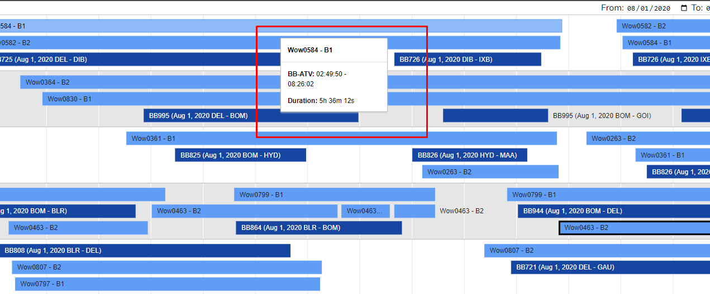

## BLUEBOX - FLIGHT VISUALISATION TASK

To create a timeline visualisation of flights by several aircraft, and the operational times of the IFE server units (“Wow Boxes”) onboard.

## Getting started

Assuming you've already installed on your machine: PHP (>= 8.0.0), [Git](https://git-scm.com/) and [Composer](https://getcomposer.org).

##### Clone repository
``` bash
git clone https://github.com/devEdrick/bluebox-flight-visualisation.git 
```
``` bash
cd bluebox-flight-visualisation
```
##### Install dependencies
``` bash
composer install
```

## Serve

To serve project [http://localhost:8080](http://localhost:8080), by run the following command:
``` bash
php artisan serve --port 8080
```

## Output

#### Main Page


#### Timeline Item Details


#### Timeline filter by date range (Default 2020-08-01 - 2020-08-02)


## Legend
-  - `Flight` 
-  - `Wow Box`

